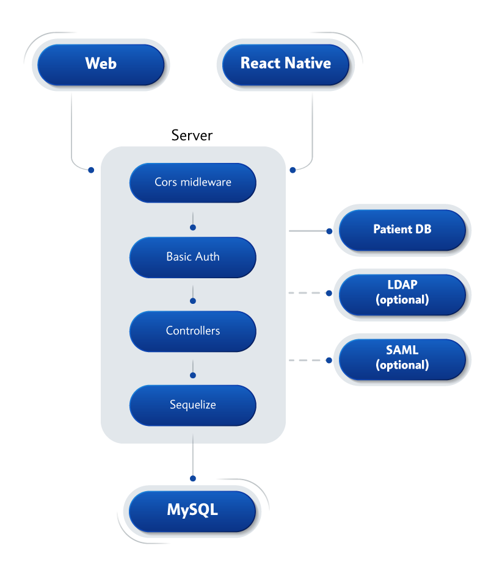
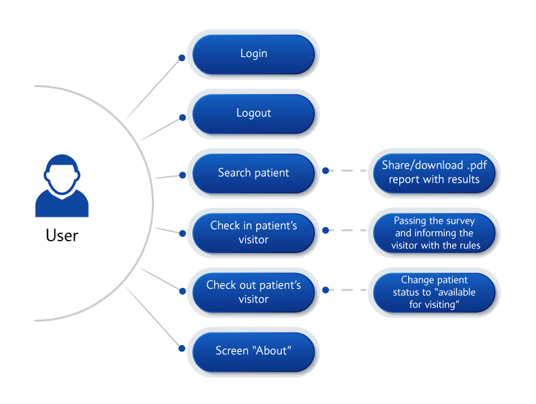

# VisitorAccess
Developed by [SoftTeco](https://softteco.com) and [Kanda Software](https://www.kandasoft.com) (link to GitHub page: https://github.com/kanda-soft/visitoraccess), the VisitorAccess application is designed to help medical facilities control the access of visitors, monitor their number, and track the exact time of visits. The application is intended to be used by hospital administrators and/or security guards and contains an in-app survey with health-related question. When a visitor comes to a medical facility, an administrator or a security guard will use the app to ask questions about the visitor’s health. Based on the answer, the visitor will be either allowed or declined for a visit. The application automatically tracks the time of the visit as soon as the user approves it and also displays the name of a person responsible for allowing the visit.
# Tech Stack
### Frontend, Mobile application
- [React](https://github.com/facebook/react) / [React Native](https://facebook.github.io/react-native/)
- [React Navigation](https://github.com/react-community/react-navigation)
- [Redux](https://redux.js.org/)
- [Redux-Persist](https://github.com/rt2zz/redux-persist)
### Backend
- [Express](https://github.com/expressjs/express)
- [Sequelize](https://github.com/sequelize/sequelize) 
- [Swagger](https://github.com/swagger-api/swagger-node)
# Architecture

# Use case diagram

# Contact information

 
https://softteco.com
 
<info@softteco.com>
 
 

 
 https://www.kandasoft.com
 
<contact@kandasoft.com>

# License
This code is distributed under the terms and conditions of the [MIT](LICENSE)
